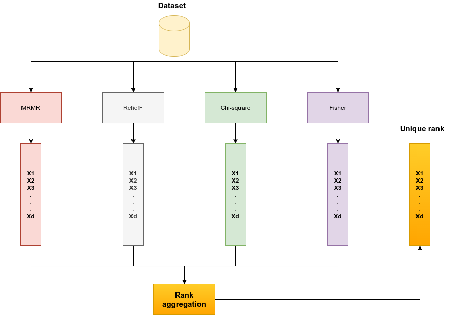
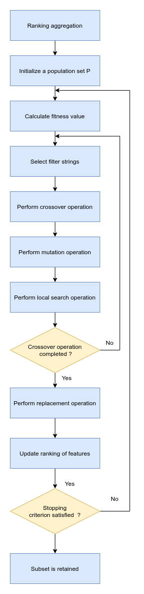

# RA-GA
The code of RA-GA algorithm, which combines a wrapper-based genetic algorithm with a ranking aggregation filter technique to address the feature selection issue.

## Description
Feature Selection (FS) is an important stage of data preprocessing, which is applied in many machine learning applications. As real-world data contains irrelevant, redundant, and noisy features, 
the main objective of feature selection is data-dimensionality reduction, in which the smallest-size subset of features is selected to maximize the model performance. 

RA-GA algorithm include 2 stage: 
 
# Stage 1

Apply a filter approach that relies on correlation information and
other ranking criteria to score features. A ranking list is obtained according to
each ranking criterion, which provides an ordering of features. Then aggre-
gate these ranking lists to obtain an optimal ranking order which allows taking
advantage of all the criteria. 
 

# Stage 2

The proposed wrapper method is based on a genetic
algorithm in which the aggregation ranking list is used as a local operator during
the selection phase to highlight features with high ranking scores. We employ an
Artificial Neural Network (ANN) model as the target model in our wrapper ap-
proach, whose performance assists in fulfilling the evolutionary process of GA.
Finally, to deal with the problem of high-dimensional searching space, in our
study, the size of the selected feature subset is also an optimization target which
is solved by our proposed GA.

## Dependencies
[Pandas](https://pandas.pydata.org/)

[Numpy](http://www.numpy.org/)

[scikit-learn](http://scikit-learn.org/stable/)

# References

